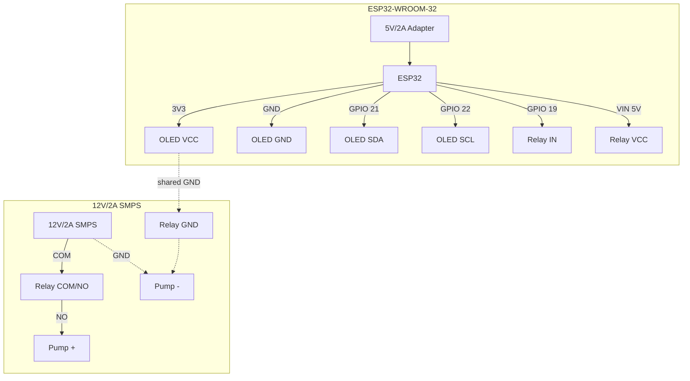
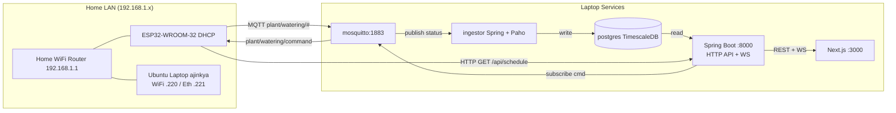
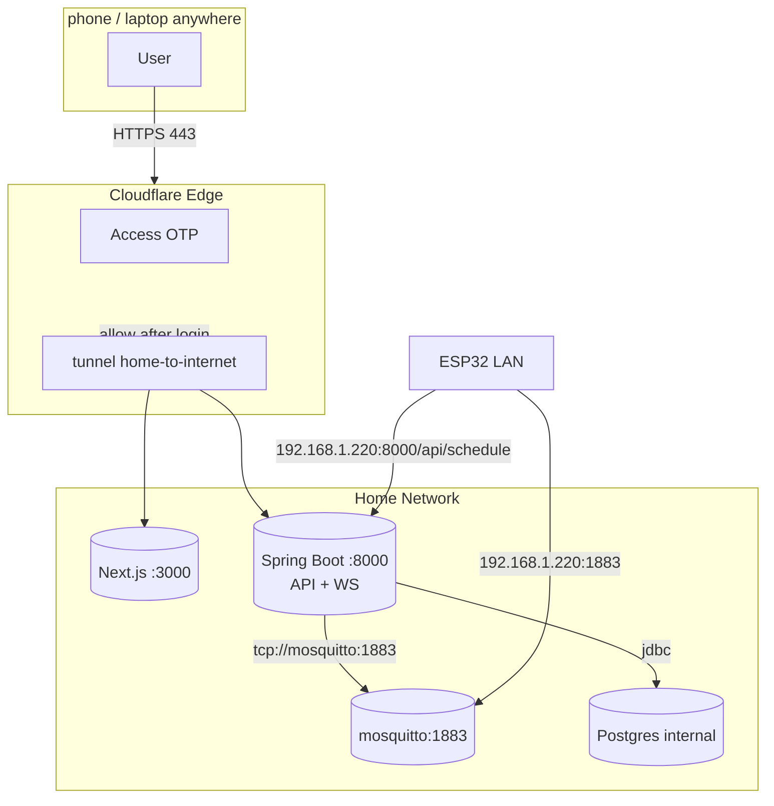

I kept killing plants by forgetting to water them for a week at a time. I had an ESP32 and a relay in a box, so I built the thing I kept talking about: a small pump my laptop controls, with a web button I can press from my phone.

The setup has been running for a bit now. My mint is alive. Here is how I wired it and what runs where.

## Parts on my desk

My controller is an ESP32-WROOM-32 board with an ESP32-D0WD-V3 chip, dual core at 240MHz, 520KB SRAM and 4MB flash. It talks to a 0.96 inch SSD1306 OLED over I2C and to a single channel Songle relay board with one GPIO.

The pump is a tiny Electronic Spices submersible that draws around 0.3 to 0.5A at 12V and lifts about half a meter. I tried a car washer pump first. It wanted up to 7A and kept tripping my 12V 2A XPOWER adapter into a restart loop, so that one went back on the shelf.

Power is split. A 5V 2A adapter feeds the ESP32 over Micro-USB. A separate 12V 2A adapter feeds only the pump through the relay contacts. The two sides meet at ground and nowhere else.

## Wiring

OLED goes to `3V3`, `GND`, `GPIO 22` for SCL and `GPIO 21` for SDA, address `0x3C`. Relay control goes to `VIN (5V)`, `GND`, and `IN` on `GPIO 19`. My early notes said `GPIO 18` and the firmware still has a comment about it. I moved the wire to 19 during testing and kept the define there.

The relay is active low, so `HIGH` at boot means off. On the load side, `12V+` goes to `COM`, pump `+` goes to `NO`, `NC` stays empty, and `12V-` goes straight to pump `-`.

I powered USB first and left the 12V unplugged until the OLED came up and I could hear the relay click. That order saved me once already.

## What the firmware does

I run PlatformIO with the Arduino framework on an `esp32dev` board. The loop never blocks. WiFi reconnect, MQTT reconnect, pump auto stop, schedule checks, publishes, and the OLED redraw at 30 FPS all run on `millis()` timers.

On boot it connects to WiFi as a station, starts NTP for `IST-5:30`, pulls the watering schedule over HTTP from `http://192.168.1.220:8000/api/schedule`, and connects to MQTT at `192.168.1.220:1883` with client id `plant-esp32-01`. It subscribes to `plant/watering/command` and `plant/watering/schedule`, and it sets a last will on `plant/watering/lwt` to `offline`.

Topics look like this:

| Topic | Direction | What I put in it |
| :--- | :--- | :--- |
| `plant/watering/status` | ESP32 to server | `{"relay":"ON","uptime_s":123,"rssi":-62}` every 10s |
| `plant/watering/telemetry` | ESP32 to server | heap, reconnect counts, chip temp, `loop_ms`, seq every 5s |
| `plant/watering/event` | ESP32 to server | `pump_start` or `pump_stop` with duration and source |
| `plant/watering/sysinfo` | ESP32 to server | chip model, flash size, MAC, IP, firmware version, retained |
| `plant/watering/command` | server to ESP32 | `{"cmd":"ON","dur_s":30}` or `{"cmd":"OFF"}` |
| `plant/watering/schedule` | server to ESP32 | retained schedule doc with interval and duration |

`command` and `event` use QoS 1. Telemetry uses QoS 0. Status, sysinfo, and schedule are retained so a UI that connects later still sees something.

The schedule survives reboots. I store enabled, interval in seconds, duration in seconds, and next run time in NVS. Default in code is every 21600 seconds for 30 seconds. If the server is down, the ESP32 still fires from its local copy using wall clock when NTP is synced, or a `millis()` fallback when it is not. When the server pushes a schedule fire over MQTT, the firmware advances its own next run so it does not water twice.

The OLED shows pump state large, plus date and time as `08SEP 20:36`, a countdown to next run like `5h 12m`, SSID and IP in the footer, and a temp field that reads `OK` until the chip passes 65C. I show the value only when it runs hot because the internal sensor reads warm and noisy.

## How the pieces fit

The ESP32 stays simple. My Ubuntu laptop at `192.168.1.220` on WiFi (`.221` on ethernet as fallback) holds Mosquitto, Postgres, the Spring Boot server, and the Next.js UI. MQTT carries control into the laptop. HTTP and a websocket carry state out to my browser.

On the laptop, `infra/docker-compose.yml` runs four containers: `mosquitto` on 1883, `postgres` with TimescaleDB internally, `server` on 8000, and `ui` on 3000. The server subscribes to `plant/watering/#` with Paho, writes to `device_events` and `device_status`, and exposes `GET /api/status`, `GET /api/events?limit=50`, `POST /api/command`, and `GET /api/schedule`. The UI loads over REST once, then follows `WS /ws` for snapshots and a 10 second heartbeat. It shows a live badge when the socket is open.

Telemetry lands in a TimescaleDB hypertable with a 7 day raw window and a 1 minute rollup kept for 90 days. Status keeps one row per device for the live view. Events keep every pump start and stop with source (`mqtt`, `schedule`, `timer`, manual) so I can tell whether I pressed the button or the timer fired.

## Reaching it from outside

I used Tailscale for a while and then moved to a Cloudflare tunnel. No inbound ports, no port forwards, UPnP off on the router. The laptop runs `cloudflared` and opens four outbound connections to the edge.

Public traffic hits `https://home.abwork.shop`, passes an Access check with email OTP, and then the tunnel routes `/` to `127.0.0.1:3000` and `/api/*` plus `/ws` to `127.0.0.1:8000`. One host means one login covers UI, API, and socket. MQTT stays on the LAN at `192.168.1.220:1883`. My phone never talks MQTT directly.

Two mistakes I will not repeat: I enabled UFW with default deny before allowing port 22 and locked myself out of SSH (the tunnel kept working, which felt unfair), and I once rebuilt the UI without purging the zone cache, so the edge served old JS with an old API URL and Chrome flagged the page. Rebuild plus `purge_everything` fixed it.

## What still bugs me

`POST /api/command` has no app login. Access gates it from the internet and my LAN is just me, so I live with it for now. Mosquitto allows anonymous on the LAN and Postgres still uses `plant/plant` from compose defaults. Changing either means updating `firmware/include/secrets.h` and reflashing at the same time, which is why I keep putting it off.

I also have no soil sensor yet. The pump must stay submerged or it burns the seal fast, and the 300 hour life rating on this little pump means I will replace it at some point. For now the countdown on the OLED plus the event log tells me enough. When the mint droops I press the button and hear the click from the other room.
